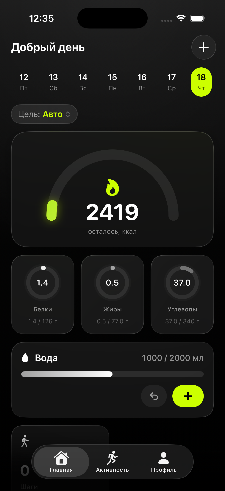
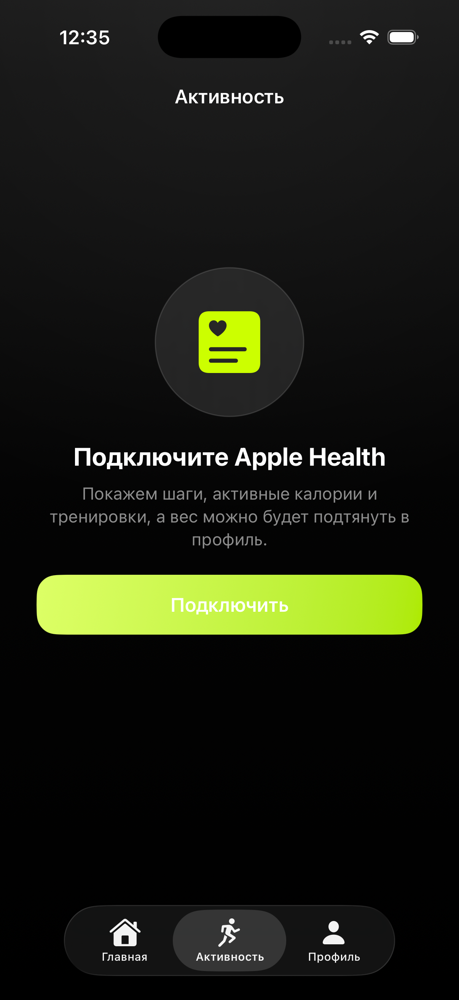
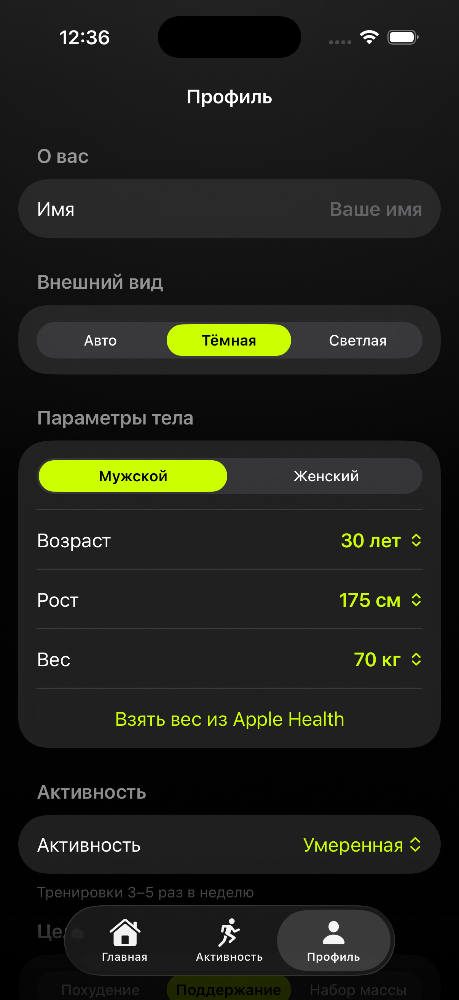
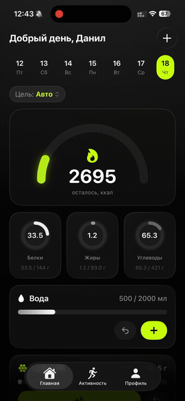

# CalorieApp — Legacy (iOS 16)

Сборка нативного трекера калорий и БЖУ под **старые iOS** — для устройств, которые не обновляются выше iOS 16 (например iPhone 11 на iOS 16). Тот же дизайн и логика, что и в основной версии, но без зависимостей, требующих iOS 17. В общем, для тех самых людей с легендарным iPhone 11 на 71% АКБ и разбитым задним стеклом. Сделано ради теста на отвали.

SwiftUI, iOS 16.0+.

> Основная (современная) версия — в ветке [`main`](../../tree/main): iOS 17+, SwiftData, Live Activities.

## Скриншоты

| Главная | Активность | Профиль |
|:---:|:---:|:---:|
|  |  |  |

## Функционал (тот же, почти)

- **Дашборд** — полукруглый спидометр калорий с закрытием дня, перебором и стриком, бенто-блоки.
- **Приёмы пищи** — по датам, с заметками; быстрый ввод и редактирование.
- **Поиск продуктов** — встроенная база классических продуктов, штрихкоды (VisionKit), Open Food Facts, поддержка ИИ и API ключей разных сервисов.
- **Жидкости** — учёт в мл, отдельная карточка воды.
- **HealthKit** — шаги, вес, активная энергия, тренировки.
- **ИИ-ассистент** — расчёт КБЖУ по названию; провайдеры OpenAI / Anthropic / Google / Groq и др. + кастомный URL, ключ хранится только на устройстве.
- **Пивометр 🍺** — шуточный раздел: живой интерактивный фон, большой каталог пивоварен, свой спидометр.

## Отличия от основной версии

- **Хранение данных** — лёгкий Codable-стор (JSON в Application Support) вместо SwiftData (его нет до iOS 17). Без внешних зависимостей.
- **Live Activities и виджет отключены** — требуют iOS 16.1+/17. На iOS 16.0 недоступны.
- iOS 17-API (`onChange` с двумя аргументами, `@Bindable`, `symbolEffect`, `contentMargins`, `presentationBackground`) заменены или закрыты `#available`.

## Стек

Swift · SwiftUI · Codable (JSON) · VisionKit · HealthKit

## Сборка

Открыть `CalorieApp.xcodeproj` в Xcode, выбрать свою команду подписи, собрать на устройство с iOS 16.0+.
