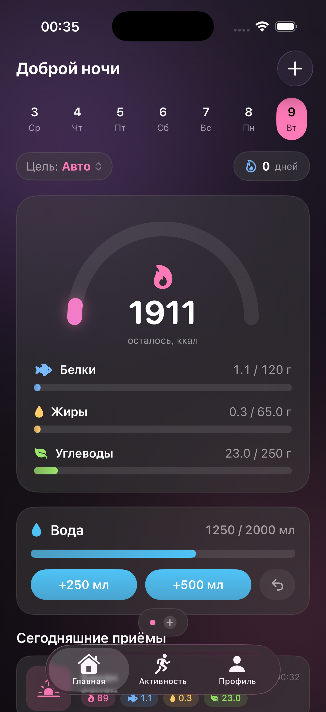
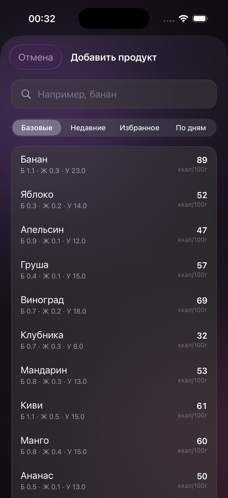
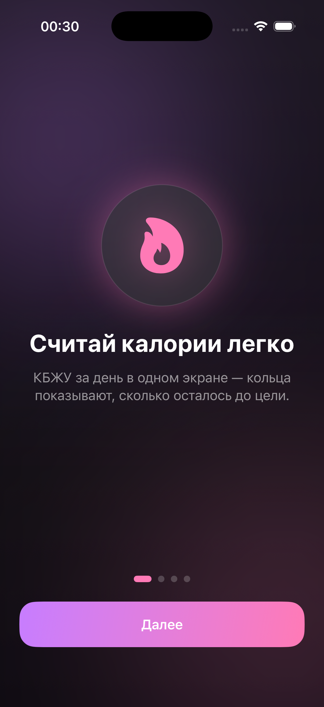

# CalorieApp

Нативный трекер калорий и БЖУ для iOS — чистый, тёмный, создавался под себя, но может пригодится и кому-то еще
SwiftUI + SwiftData, iOS 17+.

## Скриншоты

| Дашборд | Поиск продуктов | Старт |
|:---:|:---:|:---:|
|  |  |  |

## Функционал

- **Дашборд** — полукруглый спидометр калорий с закрытием дня, перебором и стриком, бенто-блоки (пока в работе) и несколько свайп-страниц.
- **Приёмы пищи** — по датам, с заметками; быстрый ввод и редактирование.
- **Поиск продуктов** — встроенная база классических продуктов, штрихкоды (VisionKit), Open Food Facts, поддержка ИИ и API ключей разных сервисов.
- **Жидкости** — учёт в мл, отдельная карточка воды.
- **HealthKit** — шаги, вес, активная энергия, тренировки.
- **ИИ-ассистент** — расчёт КБЖУ по названию; провайдеры OpenAI / Anthropic / Google / Groq и др. + кастомный URL, ключ хранится только на устройстве.
- **Live Activities + виджет** — вода на экране блокировки и в Dynamic Island.
- **Пивометр 🍺** — полезный раздел для отпуска: живой интерактивный фон, большой каталог пивоварен (еще расширяется), свой пивометр и Live Activity с кнопкой «ещё одну».

## Стек

Swift · SwiftUI · SwiftData · ActivityKit · WidgetKit · VisionKit · HealthKit

## Сборка

Открыть `CalorieApp.xcodeproj` в Xcode, выбрать свою команду подписи, собрать на устройство с iOS 17+.
